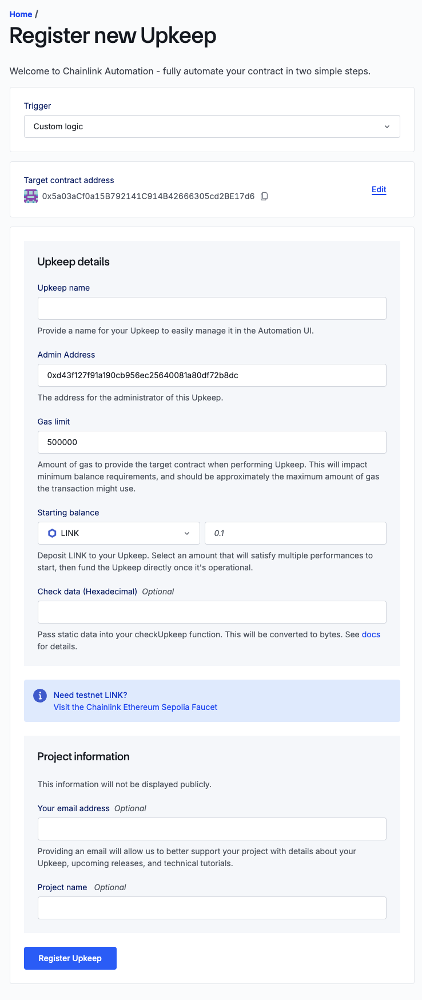

# Smart-Contract-Lottery
It is a smart contract project written in [Solidity](https://docs.soliditylang.org/en/latest/) using [Foundry](https://book.getfoundry.sh/).
- It a smart contract I developed leveraging Foundry.
- It implements a raffle-lottery system.
- Different players can enter the raffle by paying an entrance fees and a random winner is picked and the price pool (all the entrance fees combined) is given to the winner.
- It leverages [Chainlink VRF](https://vrf.chain.link/) to implement randomness in picking the winner and [Chainlink Automation](https://automation.chain.link/) to automate this smart contract.


## Getting Started

 - [git](https://git-scm.com/book/en/v2/Getting-Started-Installing-Git): You'll know you did it right if you can run `git --version` and you see a response like `git version x.x.x`
 - [foundry](https://getfoundry.sh/): You'll know you did it right if you can run `forge --version` and you see a response like `forge 0.2.0 (816e00b 2023-03-16T00:05:26.396218Z)`
 - [make](https://www.gnu.org/software/make/manual/make.html) (optional - either you can install `make` or you can simply substitute the make commands with forge commands by referring to the Makefile after including your .env file): You'll know you did it right if you can run `make --version` and you will see a response like `GNU Make 3.81...`

 
## Installation

- Install foundry-fund-me
```bash
    git clone https://github.com/yug49/foundry-fund-me-f23
    cd foundry-fund-me
```

- Make a .env file
```bash
    touch .env
```

- Open the .env file and fill in the details similar to:
```env
    SEPOLIA_RPC_URL=<YOUR SEPOLIA RPC URL>]
    ETHERSCAN_API_KEY=<YOUR ETHERSCAN API KEY>
    SEPOLIA_PRIVATE_KEY=<YOUR PRIVATE KEY>
```
- Remove pre installed cache, unecessary modules etc.
```bash
    make clean
    make remove
```

- Install dependencies and libraries.
```bash
    make install
```

- Build Project
```bash
    make build
```


    
## Deployment

### Deploy On a Local Network (Anvil Testnet)
- To Deploy on a local network first run anvil on your local terminal in current directory by running coommmand: ` make anvil`.
- Now open another terminal and let this one run in the background
- Run the following command:
```bash
make deploy
```

### Deploy on a Sepolia or Any Other Network
- To Deploy on Sepolia, after successfully creating .env file as mentioned above.
- Get youself some Sepolia Eth and LINK tokens and then run command:
```bash
make deploy ARGS="--network sepolia"
```
- register a Chainlink Automation Upkeep - [Documentation](https://docs.chain.link/chainlink-automation/compatible-contracts) 
- Go to [automation.chain.link](https://automation.chain.link/new) and register a new upkeep, enter your deployed contract Address. Choose Custom logic as your trigger mechanism for automation. Your UI will look something like this once completed:

- Enter a name of the upkeep and fund it with, lets say 3 LINK.
- You can put in your email and name too(optional).

## Scripts

- After deploying to a testnet or local net, you can run the scripts.

= Using cast deployed locally example:

```bash
cast send <RAFFLE_CONTRACT_ADDRESS> "enterRaffle()" --value 0.1ether --private-key <PRIVATE_KEY> --rpc-url $SEPOLIA_RPC_URL
```

or, to create a ChainlinkVRF Subscription:

```bash
make createSubscription ARGS="--network sepolia"
```

### You can also use Etherscan to interact with the contract:

- Open [sepolia.etherscan.io](https://sepolia.etherscan.io/).
- Search your contract address.
- Click on Contract tab > Read Contract / Write Contract.
- Connect your web3 wallet.

### How it Works?
- Once a player enters the Raffle, after a fixed interval of time(can be altered in `./script/HelperConfig.s.sol`), the Chainlink Automation Upkeep runs `Raffle::checkUpkeep()` function.
- If it returns true, it automatically runs `Raffle::performUpkeep()` function to generates a random number cytrographically through Chainlink VRF oracle service and picks a winner.


## Estimate gas
You can estimate how much gas things cost by running:
```bash
make snapshot
```

## Testing

- for local anvil
```bash
    make test
```

## Formatting
- to format all the solidity files:
```bash
    make format
```


## Coverage
- To get test coverage report.
```bash
make test-coverage
```


## 🔗 Links
Loved it? lets connect on:

[](https://x.com/yugAgarwal29)
[](https://www.linkedin.com/in/yug-agarwal-8b761b255/)

